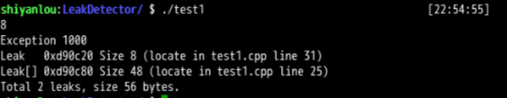
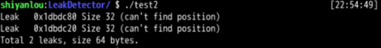

# Implementation

1. Overload the new operator.
2. Create a static object. When the program exits, this static object will call the destructor. 
3. record the memory allocation and release. Calculate the unreleased memory when program exits.

# How to use
### compile
```g++ test1.cpp LeakDetector.cpp -std=c++11 -o test1 ```

```g++ test2.cpp LeakDetector.cpp -std=c++11 -o test2 ```
### run
```./test1```

```./test2```

# Result

